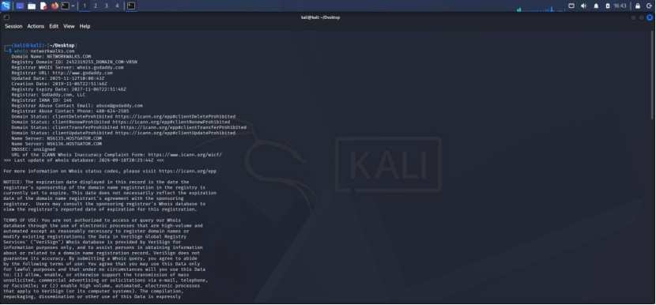
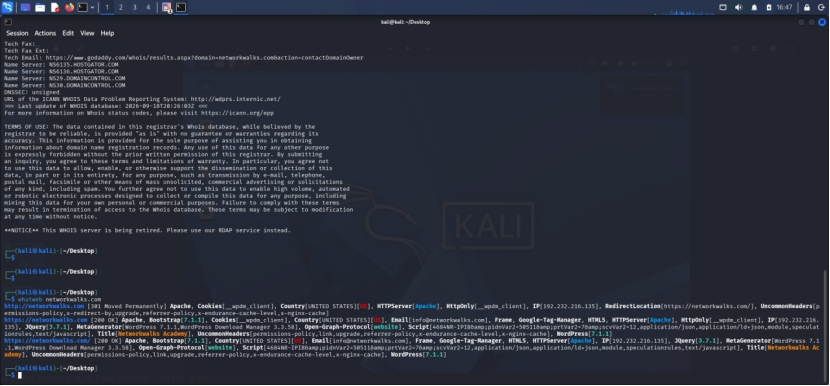
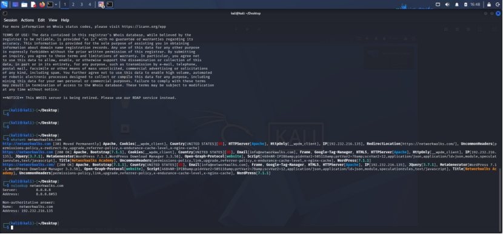
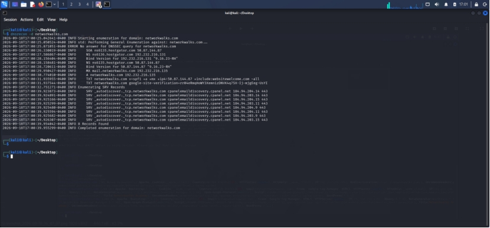
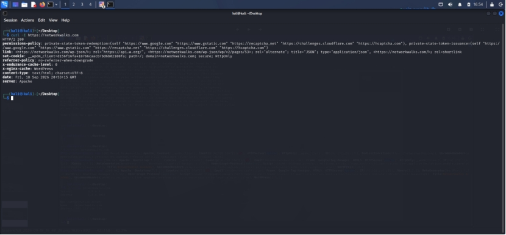
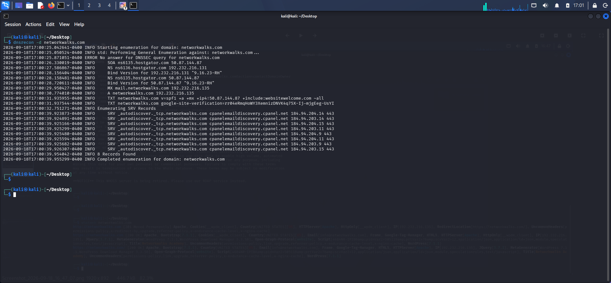
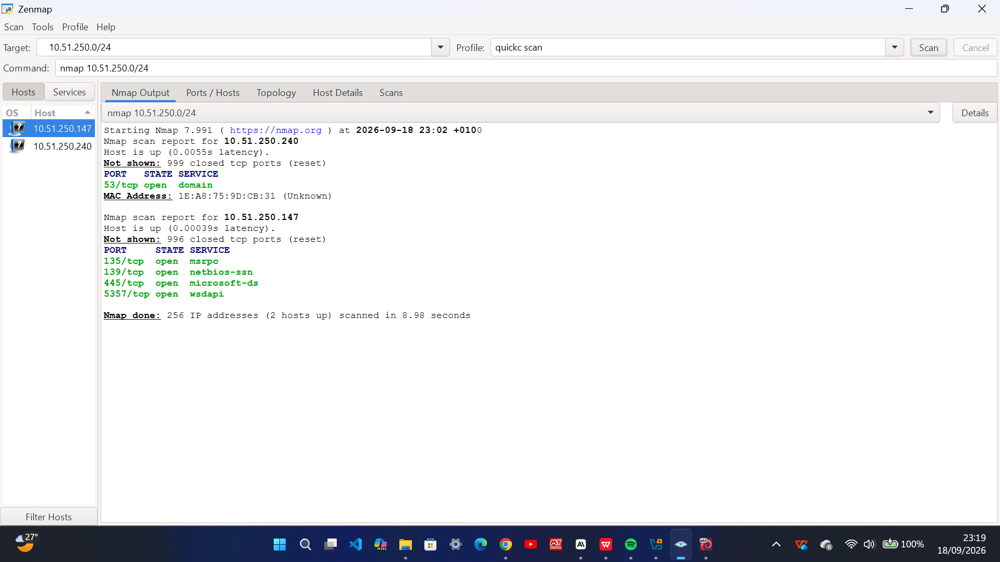
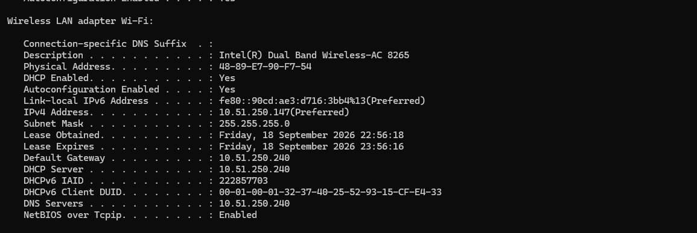
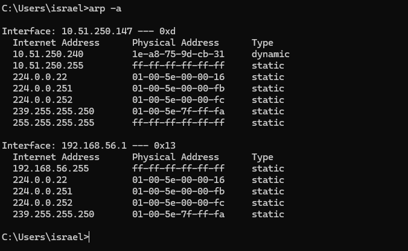

# Penetration Testing Report — Footprinting & Network Scanning (Week 2)

**Pentester:** Daramola Israel Ayomikun
**Program/Batch:** B082 – Networkwalks
**Date:** 17 August 2026
**Modules Completed:** W2-PM1 (Multiple Kali Tools) · W2-PM5 (Zenmap Scanning)
**Phases Covered:** Phase 1 (Reconnaissance & Footprinting) · Phase 2 (Scanning & Network Discovery)
**Phases 3–5:** In Progress

---

## ⚠️ Liability Disclaimer

I have performed these activities only on systems and devices where I had secured written permission, or that I own myself. All materials here are for education and research purposes only. Unauthorized access is a crime in most countries, even when nothing is damaged. Misuse of this knowledge is the sole responsibility of the person doing it — not the instructor, the author, or Networkwalks.

**Targets:**
1. `networkwalks.com` — written permission secured
2. My own local LAN network — self-owned devices

---

## Introduction

This report covers two phases of a penetration test:
- **Footprinting** the `networkwalks.com` domain using multiple Kali Linux tools (W2-PM1)
- **Scanning** my own local network using Zenmap (W2-PM5)

Together, these show how an attacker moves from gathering public information about a target to actively mapping live hosts on a network. Every step below includes the exact command used, the result observed, a screenshot as evidence, and a short note on why the finding matters from an attacker's perspective.

---

## Tools Used

| Tool | Purpose |
|---|---|
| Kali Linux & Windows | Operating systems used for reconnaissance activities |
| WHOIS | Domain registration details (owner, dates, name servers) |
| WhatWeb | Fingerprint web technologies (server, CMS, plugins, IP) |
| nslookup | Resolve the domain name to its IP address via DNS |
| wafw00f | Detect whether a Web Application Firewall protects the site |
| dnsrecon | Enumerate DNS records (NS, MX, SPF, TXT, SRV) |
| Zenmap (Nmap GUI) | Scan the local subnet for live hosts, IPs, and MAC addresses |
| Windows CMD | Local IP and MAC address identification |

---

## 4.1 Footprinting & Reconnaissance — Target: `networkwalks.com`

### Tool: WHOIS
**Command:** `whois networkwalks.com`

**Findings:** Domain registered via GoDaddy.com, LLC; hosting managed through HostGator name servers (NS6135/NS6136.HOSTGATOR.COM) with secondary DNS control via GoDaddy DomainControl (NS29/NS30). Registrant identity is masked by Domains By Proxy, LLC — no personal owner details exposed. Domain created 2019-11-06, registered through 2027, with standard registrar security locks in place. DNSSEC is unsigned.

---

### Tool: WhatWeb
**Command:** `whatweb networkwalks.com`

**Findings:** Site runs on Apache, hosted at IP `192.232.216.135`. Redirects HTTP → HTTPS (301). Built on **WordPress 7.1.1** with the **WP Download Manager plugin v3.3.58**, Bootstrap 7.1.1, and jQuery 3.7.1. Publicly exposed contact email: `info@networkwalks.com`. Uses Google Tag Manager for analytics.

---

### Tool: nslookup
**Command:** `nslookup networkwalks.com`

**Findings:** Confirms the domain resolves to IP `192.232.216.135` via Google's public DNS resolver (8.8.8.8) — cross-verifying the IP found via WhatWeb.

---

### Tool: wafw00f
**Command:** `wafw00f networkwalks.com`

**Findings:** The site is protected by **ModSecurity (SpiderLabs)**, a Web Application Firewall actively filtering malicious requests before they reach the application.

---

### Tool: dnsrecon
**Command:** `dnsrecon -d networkwalks.com`

**Findings:** Enumerated 8 DNS records, including:
- SOA/NS records confirming HostGator as the authoritative DNS provider, with BIND version `9.16.23-RH` exposed on both name servers
- MX record pointing mail service to `mail.networkwalks.com`
- SPF record defining authorized mail-sending servers
- Google site verification TXT record
- 8 SRV records for Autodiscover, pointing to cPanel's email discovery infrastructure

---

## 4.2 Network Scanning with Zenmap — Target: Local LAN

### Tool: Zenmap (Nmap GUI)
**Command:** `nmap -T4 -F 10.51.250.0/24`
**Scan Profile:** Quick scan
**Target:** Local LAN subnet — `10.51.250.0/24`

**Findings:** The scan swept 256 possible IP addresses and completed in 9 seconds, identifying **3 live hosts**:

| Host IP | MAC Address | Open Ports |
|---|---|---|
| 10.51.250.56 | EE:64:E3:AD:33:23 | None (all closed) |
| 10.51.250.240 | 1E:A8:75:9D:CB:31 | 53/tcp (domain) |
| 10.51.250.147 | (local machine) | 135/tcp (msrpc), 139/tcp (netbios-ssn), 445/tcp (microsoft-ds), 5357/tcp (wsdapi) |

*Note: This scan used Nmap's "Fast" mode (`-F`), checking only the 100 most common ports rather than the full range.*

**Why this matters (attacker's perspective):** This scan shows how quickly an attacker on the same local network could enumerate every live device, its IP/MAC address, and any exposed services — all within 10 seconds using a default quick-scan profile. Ports 135, 139, and 445 on my own machine are classic Windows SMB/RPC file-sharing ports, historically exploited in major real-world attacks (e.g. the WannaCry ransomware outbreak via the EternalBlue vulnerability on port 445). Their presence doesn't confirm an active vulnerability, but highlights the attack surface an attacker would investigate first.

The unidentified device at `10.51.250.56` was cross-verified as genuinely active via the local ARP table (matching MAC `EE-64-E3-AD-33-23`), though its exact device type wasn't identified within the scope of this exercise — router admin access was unavailable to confirm further via DHCP client records. This reflects a realistic scenario in network assessments, where not every discovered asset can be immediately identified, and such devices should be flagged for further investigation.

---

### Tool: Windows CMD (ipconfig / arp)
**Commands:** `ipconfig /all`, `arp -a`

**Findings:** Confirmed local machine IP (`10.51.250.147`) and subnet mask (`255.255.255.0`, a `/24` network). Cross-verified host `10.51.250.56` via the ARP table.

---

Together, the footprinting and scanning phases illustrate the natural progression of an attacker's methodology — from passively gathering public information about a target, to actively discovering live systems and services on a network.

---

## Risk Analysis / Impact

| # | Risk / Finding | Evidence / Observation | Potential Impact | Risk Level |
|---|---|---|---|---|
| 1 | Web technology information exposed | WhatWeb identified WordPress and WP Download Manager | Attackers may use exposed version info to identify software requiring review | 🟠 Medium |
| 2 | Server IP address identifiable | Nslookup resolved the domain to 192.232.216.135 | Reveals the network location of the web service | 🟢 Low |
| 3 | WAF technology identifiable | Wafw00f identified ModSecurity (SpiderLabs) | Reveals information about the web application's security architecture | 🟢 Low |
| 4 | DNS infrastructure information exposed | DNSRecon identified DNS, mail and service-related records | DNS information can help build a broader infrastructure profile | 🟠 Medium |
| 5 | Multiple live hosts visible on local network | Zenmap identified 3 live hosts on the network | Unknown or unauthorized devices may potentially be present | 🟠 Medium |

*The risks above are observations from footprinting and scanning, not confirmed vulnerabilities. No exploitation or vulnerability validation was performed. Further authorized testing would be required to confirm any actual vulnerability.*

---

## Recommendations

1. **Review publicly exposed technology information** — regularly audit what's visible about CMS, plugins, and web technologies.
2. **Keep software updated** — CMS platforms and plugins should be reviewed against current security advisories.
3. **Review HTTP headers** — check for unnecessary technical information exposure.
4. **Review DNS records regularly** — ensure only required information/services are publicly exposed.
5. **Maintain the WAF** — keep ModSecurity enabled and tuned.
6. **Perform regular internal network discovery** — periodically scan your own network for active devices.
7. **Investigate unknown devices** — any unexpected device found during scanning should be verified.
8. **Maintain network documentation** — keep topology and device info updated.
9. **Perform security testing with authorization** — only scan/test systems with proper permission.

---

## Conclusion

This report documented the first two phases of a penetration testing engagement: Reconnaissance/Footprinting (Phase 1) and Scanning/Network Discovery (Phase 2), completed as part of Week 2 of my ongoing internship at Networkwalks.

Using five footprinting tools (WHOIS, WhatWeb, nslookup, wafw00f, and dnsrecon) against the authorized target `networkwalks.com`, I built a reasonably complete public profile of the target — hosting provider, CMS/plugin versions, DNS infrastructure, mail configuration, and WAF — entirely through passive, publicly available information.

Using Zenmap on my own local network, I demonstrated the scanning phase, identifying all live hosts, open ports, and services within seconds.

Across both phases, the findings reinforce a consistent theme: information gathering alone does not confirm an exploitable vulnerability, but it substantially narrows an attacker's focus — all of which would typically be cross-referenced against known vulnerabilities before any real exploitation attempt.

Phases 3–5 (Gaining Access, Maintaining Access, Covering Tracks) remain in progress and will be covered in subsequent weeks.

---

## Evidence Collected

All screenshots referenced above are stored in the [`/evidence`](./evidence) folder of this repository.

---

**Author:** Daramola Israel Ayomikun
**Role:** Cybersecurity Intern, B083 – Networkwalks
**LinkedIn:** [linkedin.com/in/your-profile](https://lnkd.in/p/eNbF_3mH)

**Program:** Cybersecurity Internship at Networkwalks | Week 02
